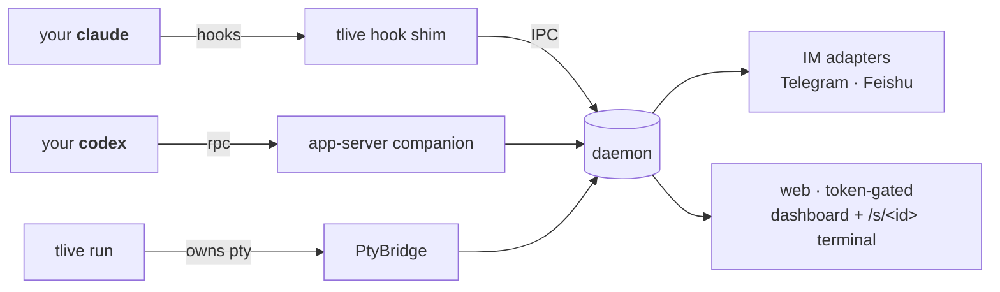

<div align="center">

# tlive-plus

**Public fork of [y49/tlive](https://github.com/y49/tlive).** This repository is maintained as `tlive-plus`; installation, development, deployment, and behavior below refer to this fork.
Vendor-neutral, self-hosted remote-approval + live-monitoring for `claude` / `codex`.
Approve tool calls, watch runs, take over typing — from Telegram, Feishu, or a web terminal.

[](https://github.com/alphalong-top/tlive-plus/actions/workflows/ci.yml)
[](LICENSE)

[English](README.md) · [简体中文](README_CN.md)

</div>

## 本仓库

这是基于 [y49/tlive](https://github.com/y49/tlive) 的公开 fork。目标是让 Codex CLI/App Server
通过飞书可靠地发送完成、失败和审批通知，并允许从通知卡片直接输入或引用
回复后继续原 Codex thread。

当前实现和版本以本仓库代码与发布记录为准。

### 定制能力

- 飞书消息和卡片回调统一使用 `open_id`，并限制为配置中的允许用户。
- 飞书卡片输入框或引用回复可恢复原 Codex thread；空闲 turn 使用
  `turn/start`，活跃 turn 使用 `turn/steer`。
- 消息到 Codex thread 的路由持久化，daemon 重启后仍可引用旧卡片继续。
- 普通文字仅在目标会话唯一时自动路由，多个会话时要求引用目标卡片。
- Codex `error` 与失败的 `turn/completed` 会生成 `Turn failed` 卡片，显示
  429/502/503、模型容量不足等错误原文；自动重试中的中间错误不会制造重复通知。
- 在失败卡片输入“继续”或引用回复，会在同一 thread 新建 turn，不会删除历
  史、回滚文件或重放上一轮。
- Codex 遇到 `429 Too Many Requests`、`502 Bad Gateway`、
  `503 Service Unavailable` 或 `Selected model is at capacity` 时，
  默认最多自动发送 3 次“从中断处继续”，等待时间依次为 60、180、
  300 秒；每次重试卡片都会显示触发错误原文，第 3 次续跑后仍失败才停止，
  中间收到有效 `agentMessage` 会清零连续失败计数并取消待发送重试。

### 开发与部署

项目使用 Node.js 20+ 和 pnpm：

```bash
pnpm install
pnpm run ci
pnpm pack --pack-destination /tmp
```

使用 `pnpm pack` 输出的 tarball 路径安装，然后重新注册 Codex 插件并重启：

```bash
npm install -g /tmp/tlive-<version>.tgz
tlive setup --hooks-only --codex
tlive stop
tlive start
tlive status
```

飞书凭证、允许用户和消息路由均位于 `~/.tlive/`，不得复制进仓库。仓库中不应
包含 `App ID`、`App Secret`、`Chat ID`、用户 `open_id` 或 Web dashboard token。

---

> Your `claude` / `codex` runs in your terminal as usual. tlive rides the
> **open hook mechanism** both vendors support to push status (and, when you
> turn it on, approval cards) to **Telegram / Feishu**, and serves a **web
> dashboard + real terminal** off your own machine — watch a run, reply to
> continue, send a screenshot, or take over typing, from any device. Works
> **regardless of subscription or API key**; your session and data never
> leave your machine.
>
> Out of the box tlive **watches and notifies** (`mode: notify`, the safe
> default — it can never hold up a tool call). Flip on remote approval —
> hold each tool call so you can Allow/Deny it from your phone — with one
> command: **`tlive mode full`** (or let `tlive setup` offer it).

> [!NOTE]
> `tlive-plus` runs your local `claude` / `codex` process and reports through
> the bundled plugin or Codex app-server companion. The daemon does not own
> agent sessions. Start from a fresh `~/.tlive/config.json` when configuring
> this fork.

**Jump to:** [Quick start](#30-seconds-to-running) · [Integration levels](#the-two-integration-levels) · [Features](#whats-in-the-box) · [Install](#install-plugins-not-config-writes) · [Codex companion](#codex-the-app-server-companion) · [Security](#security-model) · [CLI](#cli) · [Config](#config-tliveconfigjson) · [Architecture](#architecture)

## 30 seconds to running

```bash
git clone https://github.com/alphalong-top/tlive-plus.git
cd tlive-plus
pnpm install
pnpm run ci
npm install -g .

tlive setup        # wizard: registers the tlive plugin with Claude Code's/
                    # Codex's own plugin manager (hooks, skill, /tlive:*
                    # commands), then IM credentials — or skip IM entirely
                    # and say "help me configure tlive" inside Claude/Codex
tlive start        # daemon up — prints web URLs + a QR code for your phone

tlive run claude   # (optional) wrap the session → live web terminal + preview card
```

Scan the QR once — the dashboard lists every session and streams each run.
Turn on remote approval (`tlive mode full`) and, when a tool call needs
approval, your IM gets a card with **Allow / Deny / Always-allow** buttons and
the web card lights up red.

## The two integration levels

| | hooks/companion only (`claude`/`codex` as usual) | wrapped (`tlive run claude`/`codex`) |
|---|---|---|
| Approval cards (IM + web) | ✅ | ✅ |
| Stop-resume by IM reply | ✅ (reply window) | ✅ |
| Session card on dashboard | ✅ status / last message | ✅ + live terminal preview |
| Real web terminal (xterm) | — | ✅ multi-device, phone keys |
| IM text injection (quote-reply → typed into the pty) | — | ✅ |
| IM photo/file → agent | — | ✅ (downloaded, path injected) |
| Web paste/drop upload | — | ✅ |

Hooks-only always works — wrapping is pure addition. The **Approval cards**
row needs remote approval on (`tlive mode full`); the default `notify` mode
does everything else — live monitoring, turn-finished / waiting notifications,
reply-to-continue, the web terminal — without ever holding a tool call. IM
messages carry a `label · ` prefix (the session's directory) but no longer
mark wrapped vs. hooks-only visually — the continue card's own "Reply to
continue" line makes the distinction moot for what you actually do.

## What's in the box

- **Posture — `off` / `notify` (default) / `full` / `all`.** One coarse
  switch that sits above every fine toggle, in escalation order (how much
  tlive intercepts). **`off`** makes every hook a no-op (kill switch — no
  gating, notifications, monitoring, or daemon autostart). **`notify`**
  (default) watches and notifies but the shim can never hold or block an
  approval — every prompt stays 100% native (your local terminal dialog, or
  CC's own auto-deny when headless); when a prompt is waiting at the terminal
  you still get told (desktop toast, read-only dashboard card, graced IM
  text — pointers back to the terminal, never a decision). **`full`** turns
  on remote approval for the main session: tlive holds each tool call so you
  can answer it from IM / desktop / dashboard (everything the *Approvals*
  bullet below describes), in parallel with the terminal dialog — first
  answer wins. Sub-agent prompts still pass through to the terminal.
  **`all`** holds sub-agent approvals too — the trade is that **a held
  sub-agent has no terminal dialog until the window ends**, because Claude
  Code awaits the hook before deciding whether to build one; use it only when
  nobody is at the keyboard, and `tlive mode full` goes back. Flip postures
  live with `tlive mode off|notify|full|all` (or `/mode` from IM — a bare
  `/mode` replies with a card listing the ladder and marking the current
  rung); the shim re-reads config on the next hook, so no restart or new
  session is needed, and `tlive status` shows the effective mode. Remote
  approval is opt-in by design — a freshly-installed tool must never be able
  to silently hang a workflow.
- **Approvals** *(remote approval — `mode: full` or `all`)* — a tool call that needs
  approval is held so you can answer it from IM buttons or the web card:
  - **Parallel, first-answer-wins** — on Claude Code the `PermissionRequest`
    hook fires alongside the local permission dialog; both are live, and
    answering at the keyboard resolves the remote card ("answered in terminal")
    within seconds. **Nothing is ever auto-denied** — an unanswered card just
    leaves the local prompt in charge.
  - **Grace before sending** — `approvals.approvalGraceSec` (default 10s, `0`
    disables) holds the card first, so answering right away means it's never
    sent; otherwise it stays answerable for ~24h.
  - **Codex** — on macOS, `tlive setup` automatically makes tlive and Codex
    App/TUI share a managed `codex app-server`; both receive the same approval
    events, so the remote card and native prompt race normally. Fully reopen
    Codex App once after the initial setup.
  - **Rendering** — diffs/commands, risky-pattern flags, secret masking.
    Telegram cards stay restrained (bold titles, plain-text buttons; the only
    emoji anywhere is `⚠️` on a risky flag / error), with expandable quotes for
    long diffs — use a recent Telegram app for best rendering.
  - **Power toggles** — **"Always allow \<tool\>"** grants a per-tool pass
    (in-memory, cleared on restart; on Claude Code it answers the native dialog
    for you remotely); `/trust on|off` pauses approvals entirely.
  - **Sub-agents pass through by default** — on `full`, tlive returns `{}` and
    lets CC handle a backgrounded/async sub-agent natively, so its terminal
    dialog still appears exactly as it would without tlive. **`tlive mode
    all`** holds sub-agent approvals too, but the trade is real: CC resolves
    an async agent's hook *before* it decides whether to build a dialog, so a
    held sub-agent has **no** terminal box until the window ends — remote
    becomes the only answer path. Worth it only when nobody is at the
    keyboard; `tlive mode full` goes back.
- **Answer `AskUserQuestion` from IM or the dashboard (Claude Code only)** —
  CC fires a `PermissionRequest` for its own question tool; tlive relays it as
  a single-select or multi-select card (checkboxes, a live `Submit (N)` count,
  `Skip`) instead of Allow/Deny, on IM and on the dashboard session card
  alike. A call carrying several questions is walked one at a time — the card
  title reads `Question 2/3`, `← Back` re-answers an earlier one, and the
  batch is submitted as a whole once the last question lands. The daemon owns
  that cursor, so answering on your phone advances the dashboard card too. The local question prompt still renders in
  parallel and always wins a race, so an answer given at the keyboard is
  never overridden — `Skip` just passes the tool through so the local prompt
  can be answered instead; it is not an auto-approval of anything. Codex has
  no equivalent concept.
- **Resume** — on `Stop`, reply to the IM message (or the web reply box) and
  the session keeps going. The card's excerpt sits inside a collapsed
  expandable quote (headings, lists, tables and code all survive the
  conversion — nothing is cut mid-word or mid-fence); while that card is
  still pending, the 60-second idle "waiting for your input" notification is
  suppressed instead of piling a second message on top of it.
- **Daemon lazy-start** — hooks-only sessions no longer need a manual
  `tlive start` first: on `SessionStart` (and when `tlive run` launches), the daemon is
  started detached (non-blocking) if it isn't already up. Disable with
  `daemon.autoStart: false`; `tlive start` still works and is unaffected.
- **Failure alerts (Claude Code only)** — `PostToolUseFailure` (a tool call
  errored) and `StopFailure` (session-level error, e.g. rate-limit/billing)
  push a `⚠️`-prefixed IM message. Pure side-channel, never affects approval
  decisions; Codex has no equivalent hooks, so this only fires for Claude Code.
- **In-session welcome hint (Claude Code only)** — if IM isn't configured
  yet, `SessionStart` injects a one-line prompt into the session context
  nudging you to say "help me configure tlive"; it stops appearing once IM
  is set up. Not injected for Codex.
- **Web terminal** — `tlive run <cmd>` serves the pty at `/s/<id>`:
  xterm.js, multi-device with **last-input sizing** (whoever types owns the
  grid; everyone else sees a scaled view), screen rebuild for late joiners,
  soft-keyboard aware layout, view/input modes on touch, draggable key bar
  with Esc/Tab/⇧Tab/Ctrl-C/…, font size controls, copy-screen modal.
- **Dashboard** — `/` lists sessions: status badge, "stuck Nm" staleness,
  last assistant message, colored approval cards, live terminal previews,
  per-session mute, 📎 file upload, reply box.
- **Send anything to the agent** — IM quote-reply text, IM photos/files,
  terminal-page paste/drag-drop, dashboard 📎. All land as local paths in
  `~/.tlive/inbox` (auto-swept: 48 h age / 256 MB total) and are typed into
  the pty via bracketed paste.

## Install: plugins, not config writes

`tlive setup` (and `tlive setup --hooks-only`) no longer hand-edits
`~/.claude/settings.json` or `~/.codex/hooks.json` — it orchestrates each
vendor's **own plugin manager**:

- Claude Code: `claude plugin marketplace add <bundled dir>` then
  `claude plugin install tlive@tlive --scope user`.
- Codex (if `codex` is on `PATH`): `codex plugin marketplace add <bundled
  dir>` then `codex plugin add tlive@tlive`.

The Claude Code plugin bundles the 9 hook events, a `tlive` skill (usage,
diagnostics, security model, under the `/tlive:*` namespace), and slash
commands `/tlive:url` and `/tlive:status`. The Codex plugin ships only the
skill — Codex has no hooks and needs none; its integration is the
app-server companion (see below). The vendor **copies** the plugin into its
own cache (`~/.claude/plugins/cache` for Claude Code,
`$CODEX_HOME/plugins/cache/tlive/tlive/local/` for Codex) — after upgrading
`tlive` itself, re-run `tlive setup --hooks-only` to refresh that copy.

Ran a pre-plugin dev build that wrote hooks directly into vendor config?
Remove those entries by hand once (they'd double-fire otherwise) — see the
appendix in [docs/manual-hooks.md](docs/manual-hooks.md). tlive itself never
edits your vendor config files.

**Old vendor versions without a plugin CLI**: `tlive setup` detects this
(`claude plugin list` / `codex plugin marketplace add` failing) and prints a
pointer to the manual config appendix: [docs/manual-hooks.md](docs/manual-hooks.md)
— full `settings.json` hooks block and `hooks.json` you can paste in by
hand.

Uninstalling (`npm uninstall -g tlive`) best-effort removes the plugin via
each vendor's CLI and cleans up any leftover direct-write hooks; your
`~/.tlive` config and logs are preserved. Full purge steps:
[docs/uninstall.md](docs/uninstall.md).

**Install this fork from source:** use the quick-start commands above. They
build and globally install this repository, including the daemon, CLI, and
bundled plugins; then run `tlive setup` to register those bundled plugins.

`tlive setup` asks **which vendor(s)** to install the plugin into when it
detects both `claude` and `codex` on `PATH`: `[1] Claude Code [2] Codex
[3] both (default)`. Plugin registration always runs before the IM
credential prompts, and the IM step is fully skippable — press Enter
through it and later say "help me configure tlive" inside Claude Code or
Codex — or, in Claude Code, run `/tlive:setup` — to have the AI walk you
through it interactively (Codex has no slash commands; use the phrase).

## Codex: the app-server companion

Codex has no hooks and no trust step — the entire Claude-style hooks/trust
dance above doesn't apply. On macOS, `tlive setup` automatically bootstraps
Codex's managed local app-server, configures Codex App to use it, and persists
the login environment. tlive then adopts the same socket instead of starting a
competing writer. Fully quit and reopen Codex App once after the initial setup;
`tlive codex shared status` is only needed for inspection or repair.

This setup uses Codex App's internal `CODEX_APP_SERVER_WS_URL` transport and a
`ws+unix:` URL that points directly at the managed socket. This bypasses the
App's daemon probe, which can silently fall back to a private writer. tlive
never patches the Codex App or binary. `tlive stop` disconnects tlive but leaves
the managed app-server alive, so Codex App keeps working. `tlive codex shared
off` removes the App environment setting; fully restart Codex App to apply that
rollback.

Over that RPC connection tlive subscribes to Codex's own thread/turn
events and drives approvals through `ServerRequest`: when Codex asks for a
permission decision, tlive broadcasts the same request to IM/web and to
the native TUI prompt simultaneously — **first answer wins**, exactly like
Claude Code's parallel channel. There is no approval window to configure:
the native prompt is never blocked waiting on tlive, so there's nothing
that can time out.

If the companion can't be reached (Codex not installed, respawn exhausted
its backoff, or you're on win32 where `codex app-server` isn't wired up
yet), `tlive status` says so plainly (`codex: app-server companion
unreachable — approvals local-only`) and Codex just runs with its normal
local approval flow — no IM/web card, no crash, no degraded behavior
beyond losing the remote channel.

## Why not the official remotes?

Official remotes (Claude Remote Control / Codex mobile / Channels) have
structural gaps tlive fills:

- **Cross-agent** — one setup for Claude Code and Codex.
- **API-key users** — official remotes exclude them; tlive doesn't care.
- **Self-hosted** — no vendor cloud in the path; a single token gates the web.
- **Feishu** — official channels don't cover it.

tlive deliberately does **not** try to be "vibe-code from your phone" — the
official remotes do that better. tlive is the approval / monitoring / interject
layer for sessions you already run.

## Security model

- **Web**: every HTTP/WS request requires the single token
  (`~/.tlive/web-token`, 0600). Default bind is `0.0.0.0` so your phone can
  reach it on the LAN — the token is the gate. Set `web.bind: "127.0.0.1"`
  to go loopback-only. **Cards never carry a link to the dashboard.** The
  deep link that used to ship there carried the token itself — full control
  over every session — and sending it to IM would park that token on the
  messaging provider's servers permanently. Open the dashboard yourself (over
  your own tailscale/HTTPS reverse proxy if you need it off the LAN); IM is
  push, web is pull.
- **IM inbound**: fail-closed. Messages/button-taps are dropped unless they
  come from the configured chat; add `allowedSenders` for per-user hardening
  in group chats.
- **`/trust on` and "Always allow"** are power tools: they auto-approve.
  Both are in-memory and cleared on daemon restart. Prefer per-tool grants
  over `/trust`. Your own `permissions.deny` in Claude settings always wins —
  hooks cannot override it.
- **Fallback is silence**: no configured chat, timeout, or a daemon that's
  down → the hook emits `{}` and Claude prompts in your local terminal as if
  tlive weren't there. On Claude Code the local dialog is live the whole
  time anyway (parallel channels), so "fallback" just means the remote card
  goes quiet.
- **Codex approvals are fail-safe by construction** — the native prompt is
  never blocked waiting on tlive (no window, nothing to time out); if the
  companion is unreachable Codex just runs its own local approval flow and
  `tlive status` reports `codex: app-server companion unreachable —
  approvals local-only`. When the companion is up, the remote card and the
  native prompt race — first answer wins, same semantics as Claude Code's
  parallel channel.

## CLI

```
tlive setup            wizard + registers the vendor plugin(s) (idempotent); --hooks-only
tlive start | stop     daemon lifecycle (stop is idempotent)
tlive status           health, effective mode, web URLs + QR, config paths
tlive logs [-f]        tail the daemon log
tlive run <cmd> …      wrap a process: local terminal + web terminal
tlive url              print the dashboard URL + QR (when a full-screen app hid the run banner)
tlive mode off|notify|full|all   set posture (see "What's in the box"); takes effect on the next hook
tlive codex shared on|off|status  inspect, repair or disable setup's sharing (macOS)
tlive hook <event>     hook shim (called by Claude Code, not by you;
                        Codex has no hooks — see the app-server companion)
```

`setup`, `start`, `stop`, `status`, `logs`, `run`, `url`, `hook` are the
frozen surface (locked by `tests/contract/`); `mode` and the runtime toggles
`mute | trust | safe` (`on|off`) and `desktop` (`on|off`) are additive.

IM commands: `/mute on|off` (silence IM notifications), `/trust on|off` (pause
approvals — auto-allow everything), `/safe on|off` (auto-allow routine ops),
`/mode off|notify|full|all` (set posture; a bare `/mode` replies with the
ladder), `/sessions [search]` (page, search and select current or historical
Codex threads; use `/sessions archived [search]` for archived threads), and
`/help`. Tapping a bare command from the client's command menu replies with
on/off buttons instead of an error. Feishu continuation cards provide an
inline input; other channels can quote-reply a session message.

## Config (`~/.tlive/config.json`)

<details>
<summary>Full annotated config — every field is optional; defaults shown</summary>

```jsonc
{
  // posture: "off" | "notify" (default) | "full" | "all" (remote approval;
  // "all" also holds sub-agent prompts — see "What's in the box"). Also set
  // live with `tlive mode …` or `/mode` from IM; unset/unknown falls back to
  // notify.
  "mode": "notify",
  "adapters": {
    "telegram": { "token": "…", "chatIdAllowList": ["123"] },
    "feishu":   { "appId": "…", "appSecret": "…", "chatId": "oc_…" }
  },
  "web": {
    "enabled": true,          // default true
    "bind": "0.0.0.0",        // default; use 127.0.0.1 for loopback-only
    "port": 7681
  },
  "daemon": {
    "autoStart": true         // default true; false disables session-start lazy-start
  },
  "codex": {
    "sharedDaemon": true,             // set automatically by `tlive setup` on macOS
    // Retry terminal 429 / 502 / 503 / model-capacity failures. A real agentMessage
    // resets the counter; at the limit tlive sends the normal failure card.
    "autoRetry": {
      "enabled": true,                 // default true
      "delaysSec": [60, 180, 300]      // retry delays; array length is the retry count
    }
  },
  "approvals": {
    // `holdSubagents` was removed — `tlive mode all` replaces it (upgrading
    // from a config with `"holdSubagents": true`: that key is now dead and
    // silently ignored, so switch to `tlive mode all` to keep holding
    // sub-agent approvals).
    // remote-approval window in seconds, shared by both vendors. The remote
    // channel runs parallel to the local prompt, so a long window costs
    // nothing — timing out never approves or denies anything, it only
    // forces you back to the keyboard.
    "windowSec": 86200,       // default ~24h (also the max; min 60)
    // grace period before an approval card is sent — answering at the
    // keyboard within this window means it's never sent at all
    "approvalGraceSec": 10,   // default 10s, 0 disables
    // desktop notification (Linux notify-send) when a card goes out —
    // background tool calls render no local dialog while the hook pends, so
    // this is the at-the-computer pointer to the phone card / dashboard
    "desktopNotify": true,    // default true; silent no-op without notify-send
    // how much auto-approves without a card. OMITTED (the default) = nothing:
    // every request CC would have asked about still gets asked. Setting this
    // CHANGES WHAT CC ASKS YOU — the hook only fires when a dialog was about to
    // appear, so an auto-allow here removes a prompt you would have seen.
    //  omitted (default) — nothing is auto-allowed
    //  "readonly"        — also auto-allow Read/Glob/Grep
    //  "safe"            — also auto-allow routine ops (non-dangerous Bash,
    //                      edits to non-sensitive paths); dangerous ops
    //                      (rm -rf, sudo, curl|sh, sensitive-path writes…),
    //                      MCP/unknown tools, and AskUserQuestion still ask.
    // Cuts the card volume for autonomous / agent-driven runs. Toggle live with
    // /safe on|off. Never crosses the danger floor — only /trust on auto-allows
    // dangerous ops.
    // "autoApprove": "readonly",
    // what a HELD approval does when its window times out with nobody
    // answering: "defer" (default) → pass-through {} (CC-native fallback);
    // "deny" → deny with a "timed out" message so the turn can end and the
    // continuation card can redirect the agent. Never auto-allows.
    "timeoutAction": "defer"
  },
  "allowedSenders": [{ "channel": "telegram", "userId": "42" }]  // optional
}
```

</details>

## Tips

- **Persistent sessions**: tlive intentionally does not own sessions —
  `tlive run` dies with your terminal. Want detach/reattach? Combine:
  `tmux new -s work tlive run claude`. tmux keeps it alive; tlive keeps the
  web/IM layer on it.
- **Scroll on phone**: view mode converts touch-drag into wheel events —
  full-screen TUIs (claude) scroll their transcript exactly like a desktop
  mouse wheel. Use `Ctrl-R` on the key bar for claude's transcript mode.
- **Am I wrapped?** Wrapped processes see `TLIVE_SESSION=<id>` in their
  environment (like `$TMUX`); `tlive run` refuses to nest inside a wrapped
  session. Several wrapped sessions in the SAME directory are fine — each is
  its own card, and hook traffic from inside a wrapper is routed to that
  exact card via `TLIVE_SESSION`.
- **Windows**: supported by design (named pipes, ConPTY) but less battle-tested
  than Linux/macOS — issues welcome.

## Architecture



- The **daemon** never owns sessions; it brokers approvals/resumes, fans out
  pty bytes, and serves the web.
- The **frozen surface** (contracts locked by `tests/contract/`) is documented
  in [KERNEL.md](KERNEL.md).

## Development

```bash
git clone https://github.com/alphalong-top/tlive-plus.git
cd tlive-plus
pnpm install
pnpm run ci
```

## License

MIT. See [LICENSE](LICENSE). Issues and PRs welcome — [Development](#development)
above has the whole setup.
